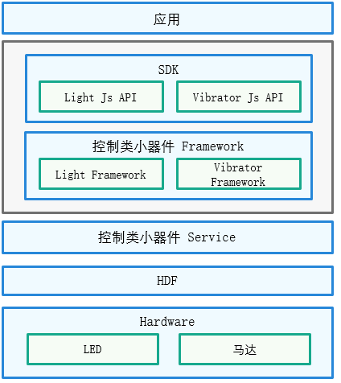

# Miscdevice<a name="ZH-CN_TOPIC_0000001148523206"></a>

-   [简介](#section11660541593)
-   [Sensors\_miscdevice组件目录](#section44981327519)
-   [约束](#section98068674513)
-   [使用](#section1581412211528)
    -   [接口说明](#section15684191115524)
    -   [使用说明](#section79302049192310)

-   [相关仓](#section96071132185310)

## 简介<a name="section11660541593"></a>

小器件是指用于向外传递信号的设备，包括马达和LED灯，本组件对开发者提供控制马达振动和LED灯开关的能力，其架构图如下所示：

**图 1**  小器件架构图<a name="fig4460722185514"></a>  




## Sensors\_miscdevice组件目录<a name="section44981327519"></a>

```
/base/sensors/miscdevice
├── frameworks                 # 框架代码
│   └── native                 # 客户端连接服务的Native方法
├── interfaces                 # 对外接口存放目录
│   ├── native                 # native 实现
│   └── plugin                 # Js API
├── sa_profile                 # 服务名称和服务的动态库的配置文件
├── services                   # 服务的代码目录
│   └── miscdevice_service     # 小器件服务，包含马达和Led灯，控制马达振动和灯的开关
└── utils                      # 公共代码，包括权限、通信等能力
```

## 约束<a name="section98068674513"></a>

-   要使用器件的功能，设备必须具有对应的器件。
-   针对马达，开发者需要请求相应的权限才能使用。

    **表 1**  器件权限列表

    <a name="table1379101653916"></a>
    <table><thead align="left"><tr id="row137911161397"><th class="cellrowborder" valign="top" width="15.728427157284273%" id="mcps1.2.5.1.1"><p id="p15138132134118"><a name="p15138132134118"></a><a name="p15138132134118"></a>器件</p>
    </th>
    <th class="cellrowborder" valign="top" width="28.537146285371463%" id="mcps1.2.5.1.2"><p id="p2798169398"><a name="p2798169398"></a><a name="p2798169398"></a>权限名</p>
    </th>
    <th class="cellrowborder" valign="top" width="18.168183181681833%" id="mcps1.2.5.1.3"><p id="p14791716163914"><a name="p14791716163914"></a><a name="p14791716163914"></a>敏感级别</p>
    </th>
    <th class="cellrowborder" valign="top" width="37.56624337566243%" id="mcps1.2.5.1.4"><p id="p379171633919"><a name="p379171633919"></a><a name="p379171633919"></a>权限描述</p>
    </th>
    </tr>
    </thead>
    <tbody><tr id="row12791216173912"><td class="cellrowborder" valign="top" width="15.728427157284273%" headers="mcps1.2.5.1.1 "><p id="p18658132191310"><a name="p18658132191310"></a><a name="p18658132191310"></a>马达</p>
    </td>
    <td class="cellrowborder" valign="top" width="28.537146285371463%" headers="mcps1.2.5.1.2 "><p id="p8826341131218"><a name="p8826341131218"></a><a name="p8826341131218"></a>ohos.permission.VIBRATE</p>
    </td>
    <td class="cellrowborder" valign="top" width="18.168183181681833%" headers="mcps1.2.5.1.3 "><p id="p207991683914"><a name="p207991683914"></a><a name="p207991683914"></a>system_grant</p>
    </td>
    <td class="cellrowborder" valign="top" width="37.56624337566243%" headers="mcps1.2.5.1.4 "><p id="p118061614399"><a name="p118061614399"></a><a name="p118061614399"></a>允许应用程序使用马达</p>
    </td>
    </tr>
    </tbody>
    </table>


## 使用<a name="section1581412211528"></a>

本节以马达为例，说明其提供的接口功能以及使用流程。

### 接口说明<a name="section15684191115524"></a>

马达主要提供的功能有：触发振动，停止振动。JS API类开放能力如下：

**表 2**  马达JS API的主要接口

<a name="table1738121244713"></a>
<table><thead align="left"><tr id="row4381111254710"><th class="cellrowborder" valign="top" width="31.209999999999997%" id="mcps1.2.3.1.1"><p id="p1738116127470"><a name="p1738116127470"></a><a name="p1738116127470"></a>接口名</p>
</th>
<th class="cellrowborder" valign="top" width="68.78999999999999%" id="mcps1.2.3.1.2"><p id="p10381161224717"><a name="p10381161224717"></a><a name="p10381161224717"></a>描述</p>
</th>
</tr>
</thead>
<tbody><tr id="row18381121274715"><td class="cellrowborder" valign="top" width="31.209999999999997%" headers="mcps1.2.3.1.1 "><p id="p15297217910"><a name="p15297217910"></a><a name="p15297217910"></a>startVibration(effect: VibrateEffect, attribute: VibrateAttribute, callback?: AsyncCallback&lt;void&gt;)</p>
</td>
<td class="cellrowborder" valign="top" width="68.78999999999999%" headers="mcps1.2.3.1.2 "><p id="p143812128476"><a name="p143812128476"></a><a name="p143812128476"></a>按照指定的effect和attribute触发振动。effect为振动效果，attribute为振动属性，返回callback表示触发振动是否成功。</p>
</td>
</tr>
<tr id="row29912332312"><td class="cellrowborder" valign="top" width="31.209999999999997%" headers="mcps1.2.3.1.1 "><p id="p599153172316"><a name="p599153172316"></a><a name="p599153172316"></a>startVibration(effect: VibrateEffect, attribute: VibrateAttribute): Promise&lt;void&gt;</p>
</td>
<td class="cellrowborder" valign="top" width="68.78999999999999%" headers="mcps1.2.3.1.2 "><p id="p1099114392316"><a name="p1099114392316"></a><a name="p1099114392316"></a>按照指定的effect和attribute触发振动。effect为振动效果，attribute为振动属性，返回Promise表示触发振动是否成功。</p>
</td>
</tr>
<tr id="row10382181218477"><td class="cellrowborder" valign="top" width="31.209999999999997%" headers="mcps1.2.3.1.1 "><p id="p764313511343"><a name="p764313511343"></a><a name="p764313511343"></a>stopVibration(stopMode: VibratorStopMode, callback?: AsyncCallback&lt;void&gt;)</p>
</td>
<td class="cellrowborder" valign="top" width="68.78999999999999%" headers="mcps1.2.3.1.2 "><p id="p1738291234712"><a name="p1738291234712"></a><a name="p1738291234712"></a>按照指定的要停止的振动模式来停止振动。stopMode为枚举马达两种振动类型，VIBRATOR_STOP_MODE_TIME、VIBRATOR_STOP_MODE_PRESET分别为停止duration模式的振动和停止预置EffectId模式的振动，返回callback表示停止振动是否成功。</p>
</td>
</tr>
<tr id="row2087541618235"><td class="cellrowborder" valign="top" width="31.209999999999997%" headers="mcps1.2.3.1.1 "><p id="p13875201620231"><a name="p13875201620231"></a><a name="p13875201620231"></a>stopVibration(stopMode: VibratorStopMode): Promise&lt;void&gt;</p>
</td>
<td class="cellrowborder" valign="top" width="68.78999999999999%" headers="mcps1.2.3.1.2 "><p id="p14875916142317"><a name="p14875916142317"></a><a name="p14875916142317"></a>按照指定的要停止的振动模式来停止振动。stopMode为枚举马达两种振动类型，VIBRATOR_STOP_MODE_TIME、VIBRATOR_STOP_MODE_PRESET分别为停止duration模式的振动和停止预置EffectId模式的振动，返回Promise表示停止振动是否成功。</p>
</td>
</tr>
<tr id="row10382181218477"><td class="cellrowborder" valign="top" width="31.209999999999997%" headers="mcps1.2.3.1.1 "><p id="p764313511343"><a name="p764313511343"></a><a name="p764313511343"></a>stopVibration(callback: AsyncCallback&lt;void&gt;)</p>
</td>
<td class="cellrowborder" valign="top" width="68.78999999999999%" headers="mcps1.2.3.1.2 "><p id="p1738291234712"><a name="p1738291234712"></a><a name="p1738291234712"></a>停止所有模式的马达振动，返回callback表示停止振动是否成功。</p>
</td>
</tr>
<tr id="row2087541618235"><td class="cellrowborder" valign="top" width="31.209999999999997%" headers="mcps1.2.3.1.1 "><p id="p13875201620231"><a name="p13875201620231"></a><a name="p13875201620231"></a>stopVibration(): Promise&lt;void&gt;</p>
</td>
<td class="cellrowborder" valign="top" width="68.78999999999999%" headers="mcps1.2.3.1.2 "><p id="p14875916142317"><a name="p14875916142317"></a><a name="p14875916142317"></a>停止所有模式的马达振动，返回Promise表示停止振动是否成功。</p>
</td>
</tr>
<tr id="row10382181218477"><td class="cellrowborder" valign="top" width="31.209999999999997%" headers="mcps1.2.3.1.1 "><p id="p764313511343"><a name="p764313511343"></a><a name="p764313511343"></a>isSupportEffect(effectId: string, callback: AsyncCallback&lt;boolean&gt;)</p>
</td>
<td class="cellrowborder" valign="top" width="68.78999999999999%" headers="mcps1.2.3.1.2 "><p id="p1738291234712"><a name="p1738291234712"></a><a name="p1738291234712"></a>查询是否支持传入的参数effectId，返回callback表示effectId是否支持。</p>
</td>
</tr>
<tr id="row2087541618235"><td class="cellrowborder" valign="top" width="31.209999999999997%" headers="mcps1.2.3.1.1 "><p id="p13875201620231"><a name="p13875201620231"></a><a name="p13875201620231"></a>isSupportEffect(effectId: string): Promise&lt;boolean&gt;</p>
</td>
<td class="cellrowborder" valign="top" width="68.78999999999999%" headers="mcps1.2.3.1.2 "><p id="p14875916142317"><a name="p14875916142317"></a><a name="p14875916142317"></a>查询是否支持传入的参数effectId，返回Promise表示effectId是否支持。</p>
</td>
</tr>
</tbody>
</table>


### 使用说明<a name="section79302049192310"></a>

1.  导入vibrator包。
2.  触发马达按照指定持续时间振动。
3.  停止马达按照指定持续时间振动。
4.  触发按照指定振动效果字符串振动。
5.  停止按照指定振动效果字符串振动。
6.  查询是否支持'haptic.clock.timer'，如果支持则振动该effectId。
7.  停止所有类型振动。

下述的代码示例中，提供了马达振动使用的完整流程。

```
//步骤1 导包
import vibrator from '@ohos.vibrator';
export default {
    onCreate() {
        console.info('MiscdeviceJsAPI AceApplication onCreate');
        //步骤2 触发马达按照指定持续的时间振动
        try {
            vibrator.startVibration({
                type: 'time',
                duration: 1000,
            }, {
                id: 0,
                usage: 'alarm'
            }, (error) => {
                if (error) {
                    console.error('vibrate fail, error.code: ' + error.code + 'error.message: ', + error.message);
                    return;
                }
                console.log('Callback returned to indicate a successful vibration.');
            });
        } catch (error) {
            console.error('errCode: ' + error.code + ' ,msg: ' + error.message);
        }
        //步骤3 停止马达按照指定持续的时间振动
        try {
            vibrator.stopVibration("time").then(() => {
                console.log("stopVibration success");
            }, (error)=>{
                console.log("stopVibration error:" + JSON.stringify(error));
            });
        } catch (error) {
            console.error('Exception in, error:' + JSON.stringify(error));
        }
        //步骤4 触发马达按照指定的字符串效果振动
        try {
            vibrator.startVibration({
                type: 'preset',
                effectId: 'haptic.clock.timer',
                count: 1,
            }, {
                usage: 'unknown'
            }).then(()=>{
                console.log('Promise returned to indicate a successful vibration');
            }).catch((error)=>{
                console.error('Promise returned to indicate a failed vibration:' + JSON.stringify(error));
            });
        } catch (error) {
            console.error('exception in, error:' + JSON.stringify(error));
        }
        //步骤5 停止马达按照指定的字符串效果振动
        try {
            vibrator.stopVibration("preset").then(() => {
                console.log("stopVibration success");
            }, (error)=>{
                console.log("stopVibration error:" + JSON.stringify(error));
            });
        } catch (error) {
            console.error('Exception in, error:' + JSON.stringify(error));
        }
        //步骤6 查询是否支持'haptic.clock.timer'，如果支持则振动该effectId
        try {
            vibrator.isSupportEffect('haptic.clock.timer', function (err, state) {
                if (err) {
                    console.error('isSupportEffect failed, error:' + JSON.stringify(err));
                    return;
                }
                console.log('The effectId is ' + (state ? 'supported' : 'unsupported'));
                if (state) {
                    try {
                        vibrator.startVibration({
                            type: 'preset',
                            effectId: 'haptic.clock.timer',
                            count: 1,
                        }, {
                            usage: 'unknown'
                        }, (error) => {
                            if(error) {
                                console.error('haptic.clock.timer vibrator error:'  + JSON.stringify(error));
                            } else {
                                console.log('haptic.clock.timer vibrator success');
                            }
                        });
                    } catch (error) {
                        console.error('Exception in, error:' + JSON.stringify(error));
                    }
                }
            })
        } catch (error) {
            console.error('Exception in, error:' + JSON.stringify(error));
        }
        //步骤7 停止所有类型振动
        try {
            vibrator.stopVibration(function (error) {
                if (error) {
                    console.log('error.code' + error.code + 'error.message' + error.message);
                    return;
                }
                console.log('Callback returned to indicate successful.');
            })
        } catch (error) {
            console.info('errCode: ' + error.code + ' ,msg: ' + error.message);
        }
    }
    onDestroy() {
        console.info('AceApplication onDestroy');
    }
}
```

## 相关仓<a name="section96071132185310"></a>

泛Sensor子系统

[sensors\_sensor](https://gitee.com/openharmony/sensors_sensor)

**sensors\_miscdevice**

