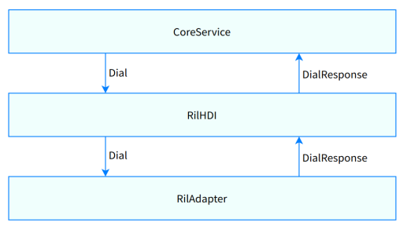

# Ril

## 简介

基于HDF（Hardware Driver Foundation）驱动框架开发的Ril驱动，能够屏蔽硬件器件差异，为上层服务提供稳定的拨打电话、发短信、激活SIM卡等稳定的接口。

Ril驱动模块主要包含HDI（Hardware Driver Interface）接口定义及其实现，对上层提供Telephony的驱动能力接口，HDI接口主要提供如下功能：

-   通话相关的业务处理能力
-   SIM卡相关的业务处理能力
-   短彩信相关的业务处理能力
-   搜网相关的业务处理能力
-   蜂窝数据相关的业务处理能力

**图 1**  Ril驱动模型图



## 目录

该仓下源代码目录结构如下所示

```
/drivers/peripheral/ril
├── figures                # readme资源文件
├── interfaces             # Ril模块对上层服务提供的驱动能力接口
│   └── include            # Ril模块对外提供的接口定义
```

## 约束

-   开发语言：C++ 。
-   软件约束：需要与RIL Adapter模块（ril\_adapter）配合使用。
-   硬件约束：需要搭载的设备具备可以进行独立蜂窝通信的Modem以及SIM卡。

## 说明

### 接口说明

Ril驱动提供给framework层可直接调用的能力接口，主要功能有：通话、SIM卡、短彩信、蜂窝数据、事件上报等业务。Ril驱动模型对HDI开放的API接口功能如表1：

**表 1** Ril HDI 接口列表

| 接口名                                                       | 功能描述                                                     |
| ------------------------------------------------------------ | ------------------------------------------------------------ |
| int32_t SetCallback(const sptr\<IRilCallback\> &rilCallback) | 设置IRil回调接口。 |
| int32_t Dial(int32_t slotId, int32_t serialId, const DialInfo &dialInfo) | 拨打电话，slotId 表示卡槽ID，serialId 表示请求的序列化ID，dialInfo 表示拨号信息。 |
| int32_t Answer(int32_t slotId, int32_t serialId) | 接听电话，slotId 表示卡槽ID，serialId 表示请求的序列化ID。 |
| int32_t SendGsmSms(int32_t slotId, int32_t serialId, const GsmSmsMessageInfo &gsmSmsMessageInfo) | 发送GSM短信，slotId 表示卡槽ID，serialId 表示请求的序列化ID，gsmSmsMessageInfo 表示GSM短信信息。|
| int32_t SetActiveSim(int32_t slotId, int32_t serialId, int32_t index, int32_t enable) |  激活或去激活SIM卡，slotId 表示卡槽ID，serialId 表示请求的序列化ID，index 表示SIM卡信息的索引值，enable 表示激活状态 |
| int32_t GetOperatorInfo(int32_t slotId, int32_t serialId) | 查询运营商名称信息，slotId 表示卡槽ID，serialId 表示请求的序列化ID。 |
| int32_t ActivatePdpContext(int32_t slotId, int32_t serialId, const DataCallInfo &dataCallInfo) | 查询运营商名称信息，slotId 表示卡槽ID，dataCallInfo 表示数据业务信息。 |
| int32_t SetRadioState(int32_t slotId, int32_t serialId, int32_t fun, int32_t rst) | 给Modem上下电，slotId 表示卡槽ID，serialId 表示请求的序列化ID，fun 表示功能模式，rst 表示是否复位。 |

完整的接口说明请参考：[ drivers_interface_ril](https://gitee.com/openharmony/drivers_interface/blob/master/ril/v1_1/IRil.idl)。

### 使用说明

本节以拨打电话为例进行介绍。

代码示例

```c++
#include "V1_1/iril.h"

/* Ril回调类 */
class RilCallback : public HDI::Ril::V1_1::IRilCallback {
    int32_t DialResponse(const HDI::Ril::V1_1::RilRadioResponseInfo &responseInfo) override;
    int32_t HangupResponse(const HDI::Ril::V1_1::RilRadioResponseInfo &responseInfo) override;
    int32_t RejectResponse(const HDI::Ril::V1_1::RilRadioResponseInfo &responseInfo) override;
    int32_t AnswerResponse(const HDI::Ril::V1_1::RilRadioResponseInfo &responseInfo) override;
    ...
}

/* 回调函数 */
int32_t RilCallback::DialResponse(const HDI::Ril::V1_1::RilRadioResponseInfo &responseInfo)
{
    printf("DialResponse");
    return 0;
}

void RilSample(void)
{
    /* 创建Ril接口实例 */
    sptr<OHOS::HDI::Ril::V1_1::IRil> g_rilInterface = OHOS::HDI::Ril::V1_1::IRil::Get();
    if (g_rilInterface == nullptr) {
        return;
    }
    /* 设置回调*/
    sptr<HDI::Ril::V1_1::IRilCallback> g_cbObj = new RilCallback();
    g_rilInterface->SetCallback(RilCallback());

    /**拨打电话**/
    int32_t slotId = 0;
    int32_t serialId = 1;
    HDI::Ril::V1_1::DialInfo dialInfo = {};
    dialInfo.address = "10086";
    dialInfo.clir = 0;
    int32_t ret = g_rilInterface->Dial(slotId, serialId, dialInfo);
}
```

## 相关仓

[驱动子系统](https://gitee.com/openharmony/docs/blob/master/zh-cn/readme/%E9%A9%B1%E5%8A%A8%E5%AD%90%E7%B3%BB%E7%BB%9F.md)

[drivers\_framework](https://gitee.com/openharmony/drivers_framework/blob/master/README_zh.md)

[drivers\_adapter](https://gitee.com/openharmony/drivers_adapter/blob/master/README_zh.md)

[drivers\_adapter\_khdf\_linux](https://gitee.com/openharmony/drivers_adapter_khdf_linux/blob/master/README_zh.md)

[drivers\_peripheral](https://gitee.com/openharmony/drivers_peripheral)

[telephony_core_service](https://gitee.com/openharmony/telephony_core_service/blob/master/README_zh.md)

[telephony\_ril\_adapter](https://gitee.com/openharmony/telephony_ril_adapter/blob/master/README_zh.md)

